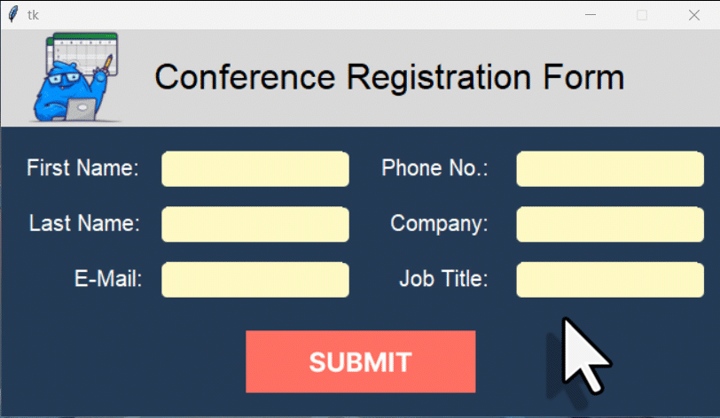

# Excel Data Entry Form

This repository hosts a Python GUI application for an Excel data entry form created using Figma and the **[tkinter Designer](https://github.com/ParthJadhav/Tkinter-Designer)** Python package. This package quickly turns Figma designs into working Python code.

In the linked YouTube video, I show how to change your Figma design into Python code and how to save form data to an Excel file using the **openpyxl** library. I also explain how to make this Python GUI into an executable file with **[PyInstaller](https://pyinstaller.org/en/stable/)**, so the application can run on computers without Python.



## Key Features
- **GUI Design**: Created in Figma and converted to Python using tkinter Designer.
- **Data Entry**: Saves form data to an Excel file using the openpyxl library.


## Installation
1. Clone the repository:
   ```bash
   git clone https://github.com/Sven-Bo/excel-data-entry-form.git
   cd excel-data-entry-form

2. Install the required packages:
    ```bash
    pip install -r requirements.txt


## Usage
Run the Python script to use the data entry form.
For more details, check out the YouTube video linked in the description.
Feel free to adjust the code to your needs and explore further possibilities with ChatGPT!

## Video Tutorial
[](https://youtu.be/HwoJtAsNCU0)


## 🤓 Check Out My Excel Add-ins
I've developed some handy Excel add-ins that you might find useful:

- 📊 **[Dashboard Add-in](https://pythonandvba.com/grafly)**: Easily create interactive and visually appealing dashboards.
- 🎨 **[Cartoon Charts Add-In](https://pythonandvba.com/cuteplots)**: Create engaging and fun cartoon-style charts.
- 🤪 **[Emoji Add-in](https://pythonandvba.com/emojify)**: Add a touch of fun to your spreadsheets with emojis.
- 🛠️ **[MyToolBelt Add-in](https://pythonandvba.com/mytoolbelt)**: A versatile toolbelt for Excel, featuring:
  - Creation of Pandas DataFrames and Jupyter Notebooks from Excel ranges
  - ChatGPT integration for advanced data analysis
  - And much more!


## 🤝 Connect with Me
- 📺 **YouTube:** [CodingIsFun](https://youtube.com/c/CodingIsFun)
- 🌐 **Website:** [PythonAndVBA](https://pythonandvba.com)
- 💬 **Discord:** [Join the Community](https://pythonandvba.com/discord)
- 💼 **LinkedIn:** [Sven Bosau](https://www.linkedin.com/in/sven-bosau/)
- 📸 **Instagram:** [sven_bosau](https://www.instagram.com/sven_bosau/)

## Support 
If you appreciate the project and wish to encourage its continued development, consider [supporting my work](https://pythonandvba.com/coffee-donation).
[](https://pythonandvba.com/coffee-donation)

## Feedback & Collaboration
For feedback, suggestions, or potential collaboration opportunities, reach out at contact@pythonandvba.com.

