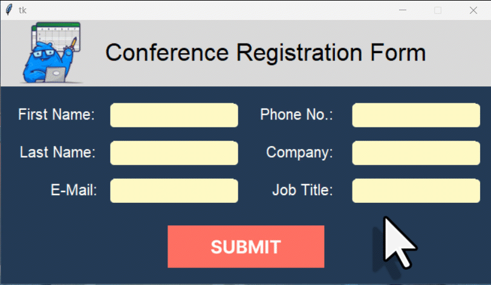

# Excel Data Entry Form

This repository hosts a Python GUI application for an Excel data entry form created using Figma and the **[tkinter Designer](https://github.com/ParthJadhav/Tkinter-Designer)** Python package. This package quickly turns Figma designs into working Python code.

In the linked YouTube video, I show how to change your Figma design into Python code and how to save form data to an Excel file using the **openpyxl** library. I also explain how to make this Python GUI into an executable file with **[PyInstaller](https://pyinstaller.org/en/stable/)**, so the application can run on computers without Python.



## Key Features
- **GUI Design**: Created in Figma and converted to Python using tkinter Designer.
- **Data Entry**: Saves form data to an Excel file using the openpyxl library.

## Installation
1. Clone the repository:
   ```bash
   git clone https://github.com/Sven-Bo/excel-data-entry-form.git
   cd excel-data-entry-form

2. Install the required packages:
    ```bash
    pip install -r requirements.txt

## Usage
Run the Python script to use the data entry form.
For more details, check out the YouTube video linked in the description.
Feel free to adjust the code to your needs and explore further possibilities with ChatGPT!

## Video Tutorial
[](https://youtu.be/HwoJtAsNCU0)

## More Solutions
Explore my tools and templates for Excel, automation, and more.

**[View all solutions](https://pythonandvba.com/solutions)**
## Connect with Me
- **YouTube:** [CodingIsFun](https://youtube.com/c/CodingIsFun)
- **Website:** [PythonAndVBA](https://pythonandvba.com)
- **LinkedIn:** [Sven Bosau](https://www.linkedin.com/in/sven-bosau/)
- **Contact:** [Get in Touch](https://pythonandvba.com/contact)
## Support
If you find this project helpful, consider buying me a coffee. 

[](https://pythonandvba.com/coffee-donation)
